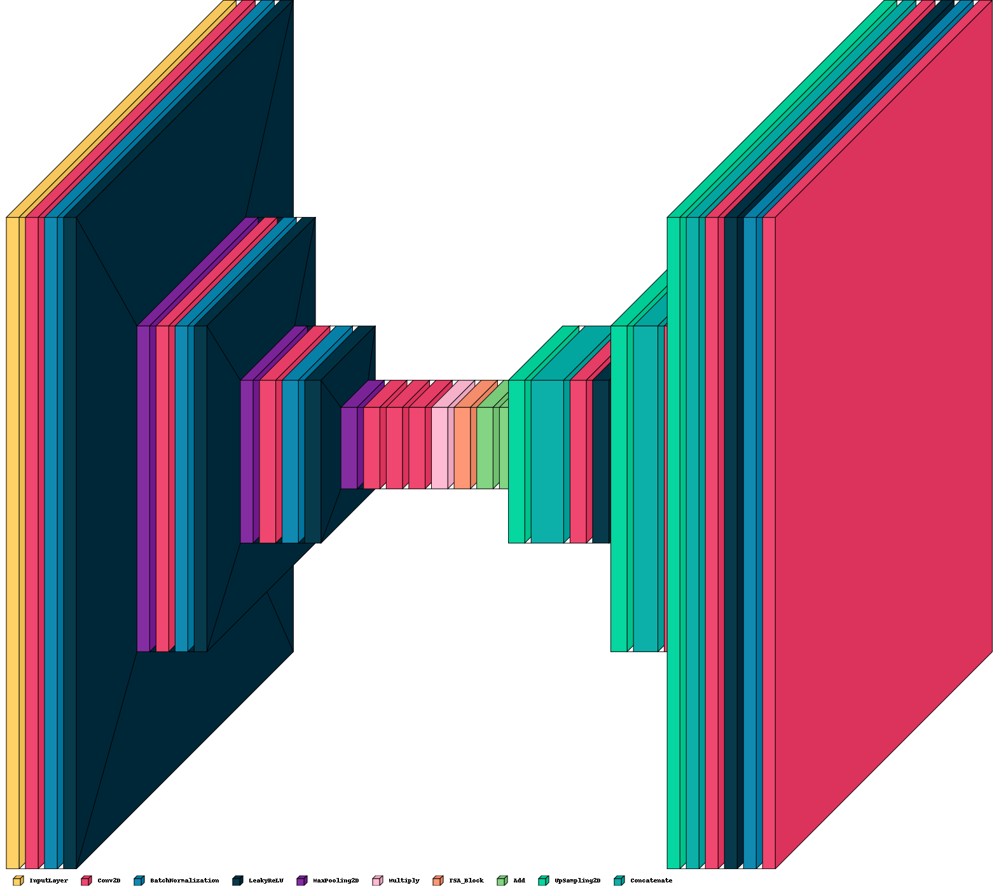

# GAN Gogh: Image Inpainting for Artistic Reconstruction

GAN Gogh is an **image inpainting model** trained on **60,000 images** from **10 different artistic movements**. The model is designed to reconstruct missing regions in corrupted artwork, preserving the essence of the original piece.

## Approach

We use a **U-Net-based GAN architecture** with an **attention mechanism** integrated into the bottleneck. The attention mechanism helps the model capture **global context**, ensuring more accurate and coherent reconstruction of the missing regions.

## Loss Functions

Our GAN employs a dual-loss strategy to achieve high-quality inpainting:

1. **Local Adversarial Loss**  
   A local discriminator assesses whether the reconstructed region is realistic and plausible within the artwork.

2. **Local MAE Loss**  
   Measures the pixel-wise difference (Mean Absolute Error) between the reconstructed and original regions, focusing only on the missing part.

---

### Why This Design?

The combination of a U-Net backbone, attention mechanism, and carefully designed loss functions allows GAN Gogh to handle complex artistic styles and seamlessly integrate reconstructed regions into the surrounding image context.

---
